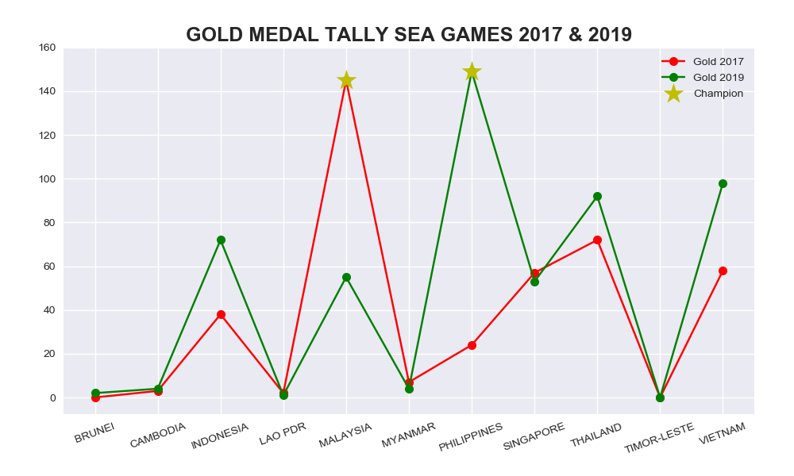
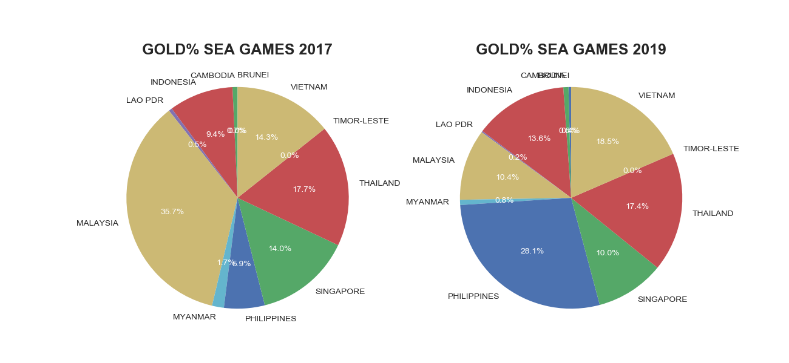

### **🏋‍♂ SEA Games 2019**

Indonesia mengakhiri SEA Games 2019 di posisi ke-empat. Total, atlet-atlet Tanah Air sukses mengumpulkan 267 medali, dengan rincian 72 emas, 84 perak, dan 111 perunggu selama perhelatan ajang multi-event olahraga se-Asia Tenggara tersebut, sejak 30 November-11 Desember 2019. Panitia SEA Games Filipina 2019 mempublikasikan daftar peserta & perolehan medali di situs resmi: [www2.2019seagames.com](https://www2.2019seagames.com/).

- [Data peserta & perolehan medali SEA Games Malaysia 2017](https://www2.2019seagames.com/countries/)
- [Data peserta & perolehan medali SEA Games Filipina 2019](https://www2.2019seagames.com/medals/)

Gunakanlah teknik _web scraping_ pada situs di atas untuk mendapatkan data lengkap perolehan medali SEA Games 2017 & 2019. Kemudian buatlah sebuah file python (__.py__) atau notebook (__.ipynb__) yang dapat memvisualisasikan data __total raihan medali emas__ beserta __persentase raihan medali emas__ tiap Negara pada SEA Games 2017 & 2019. Contoh output yang diharapkan:

- Total raihan medali emas SEA Games 2017 & 2019. Berikan marker khusus pada Negara dengan raihan medali emas terbanyak.

    

- Persentase raihan medali emas SEA Games 2017 & 2019. Tampilkan nilai persentase pada diagram lingkaran.

    

#
